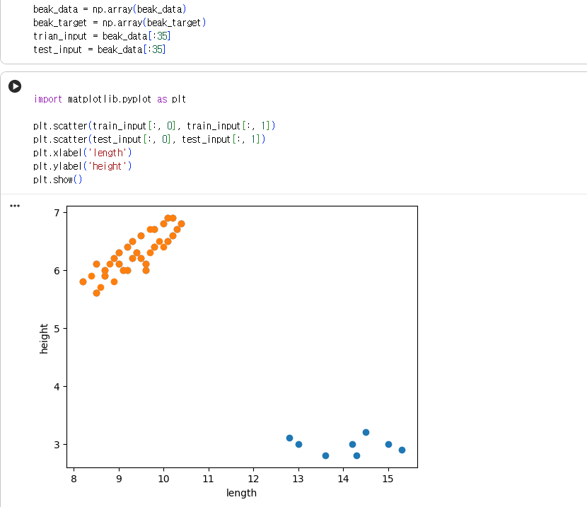
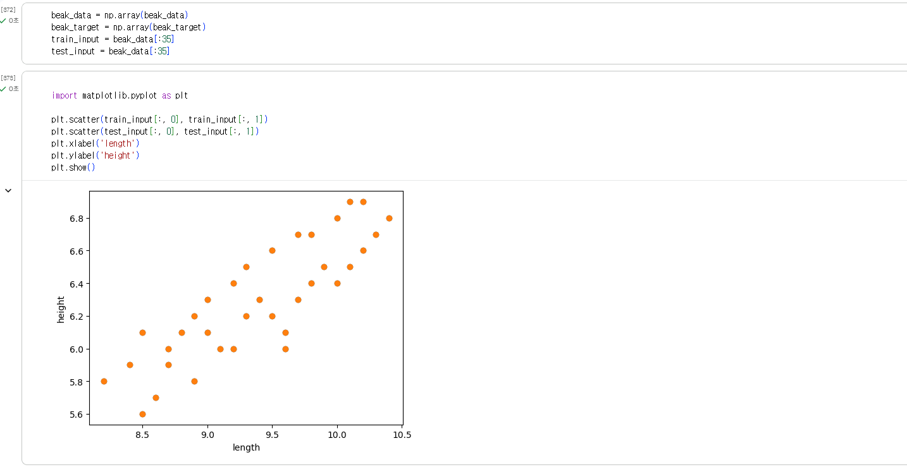

# 📘 [ML Study] 2주차 머신러닝 기초 탐구 노트
> **학습 범위**: 머신러닝 기초 (특성과 학습 → k-최근접 이웃 → numpy / matplotlib / scikit-learn)
> **학습 방식**: 교재 1~2장 개념 학습 + 실습 도중 생긴 의문점을 **AI에게 직접 질문하고 원리를 탐구한 기록**
> **실습 데이터**: 갈라파고스에서 관찰한 핀치(새)의 **부리 길이 / 부리 무게** 데이터 49마리

---

## 🧭 학습 개요 및 목표
1. **특성(Feature)과 학습(fit)** 이라는 머신러닝의 기본 언어를 이해하고, **모델(Model)** 이 무엇인지 정리한다.
2. **지도 학습 / 비지도 학습**, **훈련 세트 / 테스트 세트**의 차이를 실제 생선 데이터로 구분한다.
3. **k-최근접 이웃(KNN) 알고리즘**이 어떻게 예측하는지 직접 구현해 본다.
4. 데이터가 제각각인 스케일일 때 필요한 **데이터 전처리(표준점수)** 와 numpy의 **브로드캐스팅**을 배운다.
5. 실습 중 나온 의문점(왜 점을 안 겹치게 그렸을까? 점을 하나 고쳤는데 왜 결과가 달라졌을까?)을 **AI 질의응답으로 능동적으로 해결**한다.

---

## 1. 머신러닝 기초 개념 정리

### 1) 특성과 학습 (Feature & Fit)

* **특성(Feature)** : 데이터를 표현하는 하나의 성질입니다.
  * 이번 스터디에서 생선 49마리를 **"부리 길이"**와 **"부리 무게"** 두 가지 특성으로 나타냈습니다.
  * 데이터 한 마리는 결국 숫자 2개짜리 배열이 됩니다. → `(길이, 무게)`

```python
# 새 한 마리를 두 개의 특성으로 표현한 모습
아래새 = (8.2, 5.8)
위대한새 = (15.5, 2.7)

print(type(아래새))   # <class 'tuple'>  -> 좌표 2개가 한 마리의 데이터
```

* **학습(fit)** : 데이터에서 규칙을 찾는 과정입니다.
  * 사이킷런에서는 `fit()` 메서드가 바로 이 일을 합니다.
  * "이렇게 생긴 새는 빙어야, 저렇게 생긴 새는 도미야" 라는 **경계를 머신이 스스로 찾아내는 것**입니다.

```python
knn.fit(train_input, train_target)   # 여기서 모델이 "규칙"을 배움
```

* **모델(Model)** : 알고리즘이 구현된 객체입니다.
  * 흔히 "알고리즘"과 "모델"을 구분하지 않고 같은 뜻으로 쓰기도 합니다.
  * 이번 스터디에서 만든 `knn`라는 변수가 바로 **모델**입니다.

```python
from sklearn.neighbors import KNeighborsClassifier
knn = KNeighborsClassifier(n_neighbors=5)   # "5개의 이웃으로 판단하는 알고리즘" 객체
```

---

### 2) 지도 학습과 비지도 학습

* **지도 학습(Supervised Learning)**
  * **입력(Input)과 타깃(Target)을 짝지어** 모델을 훈련한 뒤, 새로운 데이터를 예측하는 데 씁니다.
  * 1장부터 사용한 **k-최근접 이웃**이 지도 학습 알고리즘입니다.
  * 우리가 "길이·무게 → 이 새는 빙어/도미" 라는 짝을 다 알려줬기 때문에 모델이 배울 수 있었습니다.

* **비지도 학습(Unsupervised Learning)**
  * **타깃 데이터가 없습니다.** 누가 정답을 알려주지 않습니다.
  * 따라서 "무엇을 예측한다"기보다, **입력 데이터에서 어떤 특징(패턴)을 찾는 것**이 주 목적입니다.

```python
# 지도 학습: 정답(타깃)이 함께 들어간다  → "이새는 빙어야"
knn.fit(train_input, train_target)

# 비지도 학습: 정답 없이 데이터만 건넨다  → "이 데이터는 두 덩어리로 나뉘는구나"
# 예: KMeans 등
```

> **💡 한 줄 정리**
> 지도 학습 = **"정답 붙힌 문제"** 를 풀게 하는 학습 / 비지도 학습 = **"정답 없는 문제"** 에서 패턴을 찾는 학습

---

### 3) 훈련 세트와 테스트 세트

* **훈련 세트(Train Set)** : 모델을 훈련할 때 사용하는 데이터입니다.
  * 보통 **클수록 좋습니다.** 데이터가 많을수록 모델이 경계를 정확히 그립니다.
  * 데이터 전체에서 **테스트 세트를 제외한 나머지**를 사용합니다.

* **테스트 세트(Test Set)** : 모델이 **한 번도 본 적 없는 데이터**입니다.
  * 모델의 **진짜 실력(일반화 능력)** 을 공정하게 평가하기 위해 마지막에 따로 빼둡니다.
  * 전체 데이터의 **20~50%** 를 테스트 세트로 두는 경우가 많습니다.
  * 전체 데이터가 아주 크다면 **1%만** 뺴도 충분할 수 있습니다.

```python
# 데이터 49마리 중 35마리는 학습용, 14마리는 시험용
train_input  = beak_data[:35]    # 앞의 35마리 -> 훈련 세트
test_input   = beak_data[35:]    # 뒤의 14마리  -> 테스트 세트
train_target = beak_target[:35]
test_target  = beak_target[35:]
```

| | 데이터 개수 | 역할 | 모델이 보는 시점 |
|---|---|---|---|
| **훈련 세트** | 35마리 (앞쪽) | 경계선을 배우는 역할 | ✅ 학습할 때 |
| **테스트 세트** | 14마리 (뒤쪽) | 실력을 검증하는 역할 | ❌ 학습할 때 절대 안 봄 |

> **⚠️ 왜 나눠야 할까?**
> 훈련 세트로 시험을 보면 **"답을 이미 알고 있는 시험"** 이 되는 셈이라 실력을 알 수 없습니다.
> 처음 보는 테스트 세트로 봐야 "이 모델이 진짜 생선을 구별할 줄 아는지"가 드러납니다.

---

### 4) k-최근접 이웃 알고리즘 (k-Nearest Neighbors, KNN)

* **가장 간단한 머신러닝 알고리즘 중 하나**입니다.
  * 사실 어떤 규칙을 찾아내는 게 아니라, **전체 데이터를 메모리에 가지고 있는 것이 전부**입니다.
  * 새로운 데이터가 들어오면, 그 데이터에서 **가장 가까운 k개의 이웃**을 찾아 그 정답을 다수결로 결정합니다.

* **동작 과정 (4단계)**
  1. 훈련 세트 전체를 통째로 기억한다.
  2. 새로운 새 한 마리의 특성(길이, 무게)을 확인한다.
  3. 그 새와 **가장 가까운 k개**의 기존 생선을 찾는다.
  4. 그 k마리 중 **더 많은 쪽**으로 답을 정한다.

```python
from sklearn.neighbors import KNeighborsClassifier

knn = KNeighborsClassifier(n_neighbors=5)   # 이웃 5마리를 보고 결정
knn.fit(train_input, train_target)

# 새 부리 길이 8.4cm, 무게 6.1cm 생선은 무엇일까?
pred = knn.predict([[8.4, 6.1]])
print(pred)          # [0]  -> 빙어
print(knn.predict([[14.0, 3.0]]))   # [1]  -> 도미
```

* **왜 "가장 간단한" 알고리즘일까?**
  * 데이터를 저장만 해 두고, 예측 순간에 계산하는 **"게으른 학습(Lazy Learning)"** 방식이라
  * 별도의 규칙을 만드는 과정이 아예 없습니다. 덕분에 배우는 것도 매우 빠릅니다.

> **💡 이웃 수 `n_neighbors`는 어떻게 정할까?**
> 너무 적으면(예: 1) 한 마리의 실수로 결과가 뒤집히고, 너무 많으면(예: 49개) 다수결이 무의미해집니다.
> 보통 **홀수(3, 5, 7)** 로 정해서 동률을 피하고, 여러 값을 바꿔 가며 **정확도가 가장 좋은 값**을 고릅니다.

---

### 5) 정확도 (Accuracy)

* **정확도** = **정확히 맞힌 개수 / 전체 데이터 개수**
* 사이킷런에서는 `0 ~ 1` 사이의 값으로 출력됩니다.

```python
import numpy as np

pred = knn.predict(test_input)

accuracy = np.mean(pred == test_target)   # 맞힌 비율
print(accuracy)          # 1.0  -> 14마리 전부 맞힘 (100%)
print(f"{accuracy:.2%}")  # 100.00%
```

```python
# 사이킥런 제공 함수로도 같은 값을 구할 수 있다
from sklearn.metrics import accuracy_score
print(accuracy_score(test_target, pred))
```

> **⚠️ 정확도만 보면 안 되는 경우도 있다**
> 도미 1마리, 빙어 99마리인 데이터에서 "전부 빙어라고 답하기"만 해도 정확도가 99%가 됩니다.
> 이런 경우 **정밀도(Precision) / 재현율(Recall)** 같은 다른 지표도 함께 봐야 합니다.

---

### 6) 데이터 전처리 (Data Preprocessing)

* **데이터 전처리** : 머신러닝 모델에 훈련 데이터를 주입하기 전에 **데이터를 가공하는 단계**입니다.
  * 전체 공정 중 **실제로 가장 오래 걸리는 부분**이라는 것이 유명합니다.
  * 모델은 사람이 아니기 때문에, 값의 **스케일(크기)** 이 다르면 "더 큰 쪽을 더 중요한 신호"로 착각합니다.

```python
# 새 한 마리의 (길이, 무게)만 생각해 보자
아래새 = (8.2, 5.8)     # 길이는 작지만 무게는 크다
위대한새 = (15.5, 2.7)  # 길이는 크지만 무게는 작다
# 두 값의 "크기"가 제각각이라 모델이 기준을 잡기 어렵다
```

#### 📌 표준점수 (Standard Score)

* **훈련 세트의 스케일을 바꾸는 대표적인 방법 중 하나**입니다.
* 얻는 방법: **특성의 평균을 빼고, 표준편차로 나눕니다.**

$$
표준점수 = (원래 값 - 평균) / 표준편차
$$

```python
from sklearn.preprocessing import StandardScaler

scaler = StandardScaler()

# 1) 훈련 세트의 평균·표준편차를 "학습"한다
scaled_train = scaler.fit_transform(train_input)

# 2) 테스트 세트는 훈련 세트의 평균·표준편차로 바꿔야 한다!
scaled_test = scaler.transform(test_input)
```

* ⚠️ **반드시 훈련 세트의 평균과 표준편차로 테스트 세트를 바꿔야 합니다.**
  * 테스트 세트는 **평균과 표준편차를 직접 구하면 안 됩니다.** (`fit_transform` 사용 금지)
  * 테스트 세트로 다시 학습하면, 정답을 미리 보고 깨어난 상태가 되므로 평가 결과가 왜곡됩니다.

```python
# ❌ 이렇게 하면 안 됨
scaled_test = StandardScaler().fit_transform(test_input)

# ✅ 이렇게 해야 함 (평균·표준편차는 위에서 이미 구한 것 재사용)
scaled_test = scaler.transform(test_input)
```

* **표준점수로 바꾸면 구체적인 값(몇 cm인지)은 사라집니다.**
  * 그래프의 축에 "길이 8.2"가 아니라 `z = -0.83` 같은 숫자가 찍히기 시작합니다.
  * 그래서 **원본 데이터는 절대 버리지 않고**, 스케일링한 데이터는 **별도 변수에 저장**해 두어야 합니다.

> **💡 기억하기 쉬운 비유**
> 시험 점수가 `90점, 60점, 30점`이 있을 때, 평균은 60이고 표준편차는 25입니다.
> 표준점수(=z-score)로 바꾸면 각각 `+1.2, 0, -1.2`가 됩니다.
> 이제 "원래 몇 점인지"는 알기 어렵지만, **"평균보다 얼마나 높은가"** 는 한눈에 보이고, 점수 단위가 다른 시험과도 비교할 수 있게 됩니다.

#### 📌 브로드캐스팅 (Broadcasting)

* **크기가 다른 numpy 배열에서**, 자동으로 사칙 연산을 **모두 행이나 열로 확장**해 수행하는 기능입니다.
* 배열의 크기가 다르면 보통 `ValueError`가 나지만, **브로드캐스팅 규칙이 맞으면 에러 없이 계산**됩니다.

```python
import numpy as np

data = np.array([[8.2, 5.8],
                 [9.0, 6.3],
                 [8.5, 6.1]])

print(data.shape)          # (3, 2)  -> 3행 2열

# 크기가 다른 배열(3,)을 곱하면?
result = data * 10
print(result.shape)        # (3, 2)  -> 10이 각 열 전체로 확장되어 곱해짐
```

```text
[[ 8.2,  5.8]]      ← 10이 →  →  [[10, 10],
 [ 9.0,  6.3]]         각 열로      [ 90, 10],
 [ 8.5,  6.1]]         확장됨       [ 85, 10]]
```

```python
# 브로드캐스팅 덕분에 반복문 없이 한 번에 계산
data - data.mean()    # 각 열에서 평균을 빼 줌 (축에 대한 브로드캐스팅)
```

> **💡 브로드캐스팅이 왜 중요한가?**
> `StandardScaler`가 내부적으로 표준점수를 계산할 때, 모든 원소를 하나씩 처리하는 대신
> **배열 전체에 한 번에 연산**을 적용합니다. numpy가 빠를 수 있는 핵심 이유입니다.

---

## 2. 🧰 핵심 패키지와 함수 정리

### numpy

| 함수 | 역할 |
|---|---|
| `np.array()` | 파이썬 리스트를 **numpy 배열**로 변환합니다. 머신러닝 라이브러리는 리스트가 아니라 **배열**을 받습니다. |
| `np.arange()` | 일정한 간격의 정수 또는 실수 배열을 만듭니다. |
| `np.mean()` | 평균을 구합니다. (정확도 계산에 사용) |
| `np.random.seed()` | 난수 생성기의 **초기값**을 지정합니다. |

* **`seed()` — 왜 필요할까?**
  * 랜덤 함수는 실행할 때마다 다른 값을 내놓습니다.
  * `seed()`에 **같은 정수**를 넣으면 **항상 같은 난수**가 나옵니다.
  * 그래서 "누가 실행하든 **완전히 동일한 결과**를 재현"하고 싶을 때 씁니다.

```python
np.random.seed(42)
print(np.random.rand())     # 0.37454012...

np.random.seed(42)
print(np.random.rand())     # 0.37454012...  (완전히 동일!)
```

* **`arange()` — 매개변수가 하나면 "종료 숫자"라는 걸 주의**

```python
print(np.arange(3))          # [0 1 2]   (0부터 3 직전까지)
print(np.arange(1, 4))       # [1 2 3]
print(np.arange(0, 10, 2))   # [0 2 4 6 8]  (간격 2)
```

> **⚠️ 종료 숫자는 배열에 포함되지 않습니다.** (range와 같은 규칙)
> 파이썬 리스트(range)와 비교해서 **"몇 개가 만들어지는지"** 만 기억하면 됩니다.

```python
len(list(range(3)))   # 3
len(np.arange(3))     # 3
```

---

### matplotlib

* **`scatter()`** : 산점도를 그리는 함수입니다.

```python
import matplotlib.pyplot as plt

# 처음 2개의 매개변수로 x값과 y값을 전달한다
plt.scatter(beak_data[:, 0], beak_data[:, 1])   # [:, 0] = 부리 길이, [:, 1] = 부리 무게
plt.xlabel("length")
plt.ylabel("weight")
plt.show()
```

* `beak_data[:, 0]` 은 **"모든 행에서 0번 열만 뽑아라"** 는 뜻입니다.
  * `:` → 모든 행, `0` → 0번 특성(길이)
  * 파이썬 리스트로는 `beak_data[i][0]` 처럼 반복문을 돌려야 했을 것을, numpy에서는 한 줄로 됩니다.

* **`c` 매개변수로 색깔을 지정합니다.**
  * 16진수 RGB 값(예: `#1f4fd8`)을 지정하거나, 색깔 이름 중 하나를 지정합니다.
  * `cmap` 을 함께 주면 타깃 값에 따라 색이 자동으로 매핑됩니다.

```python
# 타깃 값(0=빙어, 1=도미)에 따라 자동으로 색을 나눠 그리기
plt.scatter(beak_data[:, 0], beak_data[:, 1], c=beak_target, cmap="jet")
plt.xlabel("length")
plt.ylabel("weight")
plt.show()
```

* `c` 를 지정하지 않으면 **10개의 기본 색깔**이 순서대로 사용됩니다.
  * 기본 색깔은 <https://bit.ly/matplotlib_prop_cycle> 에서 확인할 수 있습니다.

```python
# 타깃 없이 그냥 그리기 -> 기본 색 10개가 순서대로 반복해서 나옴
plt.scatter(beak_data[:, 0], beak_data[:, 1])
```

---

### scikit-learn

* **`train_test_split()`** : 훈련 데이터를 **훈련 세트와 테스트 세트로 나누는 함수**입니다.
  * 여러 개의 배열(입력, 타깃)을 전달하면 **같은 기준으로** 나뉜 여러 세트를 돌려줍니다.

```python
from sklearn.model_selection import train_test_split

X_train, X_test, y_train, y_test = train_test_split(
    beak_data,                   # 입력(특성)
    beak_target,                 # 타깃(정답)
    test_size=0.25,              # 테스트 세트로 나눌 비율 (기본값 0.25 = 25%)
    shuffle=True,                # 나누기 전에 섞을지 (기본값 True)
    stratify=beak_target,        # 빙어:도미 비율을 유지한 채로 나눌지
    random_state=42              # 섞는 방식 고정 (재현용)
)

print(len(X_train), len(X_test))   # 36 13  (49 * 0.75 = 36.75 -> 36)
```

| 매개변수 | 기본값 | 설명 |
|---|---|---|
| `test_size` | `0.25` | 테스트 세트로 나눌 비율. 25개 중 1개 꼴로 25% |
| `shuffle` | `True` | 나누기 전에 데이터를 무작위로 섞을지 |
| `stratify` | `None` | 클래스 레이블이 담긴 배열(타깃)을 주면 **비율까지 맞춰서** 나눕니다 |
| `random_state` | `None` | 난수 시드. 지정하면 언제나 같은 결과가 나옵니다 |

* **`stratify` 를 왜 쓸까?**
  * 49마리 중 도미가 14마리밖에 없는데, 섞다가 테스트 세트에 도미가 **한 마리도 안 들어갈 수도** 있습니다.
  * 그러면 테스트가 무의미해지므로, `stratify=타깃` 을 주면 **클래스 비율을 유지**한 채로 나눠 줍니다.

```python
# stratify 없이 나누면 매번 결과가 달라질 수 있다
a, b = train_test_split(beak_target, test_size=0.2, random_state=1)
print(sum(a), sum(b))    # 도미 개수가 실행마다 흔들림

# stratify를 주면 비율이 유지된다
a, b = train_test_split(beak_target, test_size=0.2, stratify=beak_target, random_state=1)
print(sum(a), sum(b))    # 항상 비슷한 비율
```

* **`KNeighborsClassifier`** : k-최근접 이웃 알고리즘을 구현한 클래스입니다.
  * 이웃 개수는 **객체를 생성할 때** `n_neighbors` 로 지정합니다.

```python
knn = KNeighborsClassifier(n_neighbors=5)
```

* **`kneighbors()`** : k-최근접 이웃 **객체의 메서드**입니다.
  * 입력한 데이터에서 **가장 가까운 이웃을 찾아 거리와 이웃 샘플의 인덱스를 반환**합니다.
  * 기본적으로 이웃 개수는 `KNeighborsClassifier` 객체를 만들 때 지정한 개수를 사용하지만,
    `n_neighbors` 매개변수에서 다르게 지정할 수도 있습니다.

```python
# 길이 14.0, 무게 3.0 에서 가장 가까운 이웃 3마리 찾기
distances, indexes = knn.kneighbors([[14.0, 3.0]], n_neighbors=3)

print(indexes)     # [[35 40 44]]  -> 원본 데이터의 인덱스
print(distances)   # 각 이웃까지의 거리
```

* **`return_distance` 매개변수**
  * `False` 로 지정하면 **이웃 샘플의 인덱스만** 반환하고 거리는 반환하지 않습니다.
  * 기본값은 `True` 입니다.

```python
knn.kneighbors([[14.0, 3.0]], n_neighbors=3, return_distance=False)   # 인덱스만
```

---

## 3. 🔬 실습: 갈라파고스 핀치 데이터 구분하기

실습은 Jupyter Notebook(구글 콜랩) 환경에서 진행했습니다.


### 데이터 구성

* **49마리**의 갈라파고스 핀치를 두 특성으로 기록했습니다.
  * 0번~34번 (35마리): **아래새(빙어, Perissimus)** — 부리가 짧고 무거움
  * 35번~48번 (14마리): **큰새(도미, Iras)** — 부리가 길고 가벼움

```text
  부리 길이(cm)
  8 ─────────────────────────── 15

  위쪽에 몰림 → 빙어 35마리  [:35]   (8.2, 5.8) ~ (10.2, 6.9)
  아래쪽에 몰림 → 도미 14마리  [35:]   (12.5, 3.2) ~ (15.5, 2.7)
```

### 전체 실습 코드

```python
import numpy as np
import matplotlib.pyplot as plt

beak_data = np.array(beak_data)      # [부리 길이, 부리 무게]
beak_target = np.array(beak_target)  # 0: 빙어, 1: 도미

# 1) 데이터가 어떻게 생겼는지 구경
print(beak_data.shape)   # (49, 2)

# 2) 훈련 세트 / 테스트 세트로 나누기  ⚠️ 두 줄의 슬라이싱이 달라야 한다
train_input  = beak_data[:35]     # 0~34번  -> 빙어 35마리
test_input   = beak_data[35:]     # 35~끝   -> 도미 14마리
train_target = beak_target[:35]
test_target  = beak_target[35:]

# 3) 파란색 = 훈련 세트, 주황색 = 테스트 세트
plt.scatter(train_input[:, 0], train_input[:, 1], c="blue")     # 파란색 = 훈련 세트
plt.scatter(test_input[:, 0],  test_input[:, 1],  c="orange")  # 주황색 = 테스트 세트
plt.xlabel("length")
plt.ylabel("weight")
plt.show()
```

### 정상적으로 나누었을 때의 결과


> 파란 점(빙어 35마리)은 **위쪽**에, 주황 점(도미 14마리)은 **아래쪽**에 깔끔하게 나뉘어 보입니다.
> 이렇게 해야 "새가 이 두 그룹 중 어디에 가까운지"를 모델이 판단할 수 있습니다.

---

## 4. 🤖 AI와 함께 파고든 심화 질문 탐구 (Study Q&A)
> 실습 도중 "이게 말이 되나?" 싶은 결과가 나와, **AI에게 직접 물어보며 원리를 파헤친 내용**입니다.

---

### ❓ Q1. `train` 철자만 바꿨는데 왜 그래프가 완전히 달라졌을까?

#### 🔍 스터디 중 발견한 현상

`train_input` 을 실수로 `trian_input` 이라고 쳤다가, 오타를 고치고 다시 실행했는데
**파란색 점 35개가 사라지고 주황색 그룹만 남았습니다.**

```python
trian_input = beak_data[:35]   # ❌ 오타! 새 변수 'trian_input' 이 만들어짐
test_input  = beak_data[:35]

plt.scatter(train_input[:, 0], train_input[:, 1], c="blue")
plt.scatter(test_input[:, 0],  test_input[:, 1],  c="orange")
```



> 코드를 보면 **`trian_input` 을 만든 것도 아닌데, `train_input` 이 그려졌다**는 게 핵심 의문입니다.

#### 💡 AI에게 물어보고 배운 점

1. **변수는 "이름표"이고, 오타는 새 이름표를 하나 더 만드는 것**
   * `trian_input = ...` 을 실행하면, 파이썬은 **`trian_input` 이라는 새 상자를 하나 만들 뿐**입니다.
   * 기존에 있던 **`train_input` 상자는 삭제되지 않고 그대로 남아 있습니다.**
   * 즉, 오타 한 줄이 기존 변수를 **덮어쓰지도, 지우지도 않습니다.**

2. **그래서 `train_input` 은 무엇이 남아 있던 걸까? — 주피터 노트북의 "메모리 잔상"**
   * 노트북은 **위에서 아래로 순서대로 실행**하지만, **한 번 실행한 변수는 세션이 끝날 때까지 살아 있습니다.**
   * 이 스터디에서 `train_input` 이 **도미 14마리(`beak_data[35:]`)로 채워져 있었던 상태**에서 오타를 치고 실행한 것입니다.
   * `plt.scatter(train_input, ...)` 은 오타 난 `trian_input` 을 무시하고,
     **메모리에 남아 있던 옛날 `train_input`(도미 14마리)을 그대로 꺼내 그려버린 것**입니다.

3. **결과적으로 왜 저렇게 나왔나**
   * **파란 점** = 옛날 메모리에 있던 **도미 14마리(아래쪽)**
   * **주황 점** = 방금 새로 만든 **빙어 35마리(위쪽)**
   * 두 그룹의 위치가 달라서, **둘 다 눈에 보였습니다.**

```text
trian_input 을 친 상태
  파란(train_input) → 아래쪽 도미 14마리
  주황(test_input)  → 위쪽  빙어 35마리
  → 위치가 다름 → 둘 다 보임
```

4. **철자를 고친 뒤의 결과**



```python
train_input = beak_data[:35]   # ✅ 이제 train_input 이 진짜 갱신됨 → 빙어 35마리
test_input  = beak_data[:35]   # ⚠️ 여기는 여전히 [:35]
```

```text
train_input 을 고친 상태
  파란(train_input) → 위쪽 빙어 35마리
  주황(test_input)  → 위쪽 빙어 35마리   ← 둘 다 똑같음!
  → 위치가 완전히 같음 → 주황 점이 나중에 그려져 파란 점을 덮음
```

* **파란 점이 지워진 게 아니라, 주황 점에 가려진 것뿐입니다.**
* 코드상 `plt.scatter(test_input, ...)` 이 **나중에** 실행됐기 때문에,
  나중에 그린 **주황 점이 파란 점 위로 덮어씌워진 것**입니다.
* 가로축 범위도 아래쪽 점이 사라지면서 **8~10.5 구간만 확대되어** 나온 것입니다.

5. **결국 그래프가 "완성본"과 같아진 이유**


```python
train_input = beak_data[:35]   # 0~34번    (위쪽 그룹 35마리)
test_input  = beak_data[35:]   # 35~끝     (아래쪽 그룹 14마리)  ← 여기를 고쳐야 한다
```

* `train_input` 철자를 고치면서 **동시에 `test_input` 의 슬라이싱을 `[:35]` → `[35:]` 로 바꿔서**,
  두 데이터가 **완전히 서로 다른 영역(위쪽 vs 아래쪽)** 의 숫자를 갖게 되었습니다.
* 그래서 겹치거나 가리지 않고, **위쪽엔 파란 점 / 아래쪽엔 주황 점** 이 깔끔하게 나뉘어 출력됩니다.

> **💡 한 줄 요약**
> `:35` 라서 겹친 것입니다. 두 줄에 똑같이 `[:35]` 를 썼기 때문에
> `train_input` 과 `test_input` 이 토씨 하나 안 틀리고 **똑같은 35개의 데이터**를 가져왔습니다.
> **해결: `test_input = beak_data[35:]`**

---

### ❓ Q2. 파란 점이 14개인데 왜 8개로만 보일까? 나머지 6개는 어디 갔을까?

#### 🔍 스터디 중 발견한 현상

아래쪽에 그려진 파란 점을 직접 세어보니 **8개**밖에 보이지 않았습니다.
데이터는 분명 14개인데, **6개가 사라진 것처럼** 보였습니다.

#### 💡 AI에게 물어보고 배운 점

1. **점은 사라진 게 아니라, 좌표가 같아서 겹쳐 있는 것입니다.**
   * `plt.scatter()` 는 점을 그릴 때 **좌표(X, Y) 가 같은 위치에 계속 덮어씌웁니다.**
   * 데이터 사이의 수치 단위가 `0.1 ~ 0.2` 차이로 매우 가깝기 때문에, 그래프의 눈금 축 크기에서는 **하나의 점처럼 포개져 보입니다.**

2. **이 데이터셋에는 "완전히 같은 줄"이 하나도 없습니다.**
   * 49줄을 전부 대조해 보니 **완전히 동일한 수치의 행은 0개**였습니다.
   * 그러니 **코드 실수가 아니라 데이터의 수치 밀집**이 원인입니다.

3. **실제로 눈으로 확인해 보기**

| 묶음 | 데이터 | 차이 |
|---|---|---|
| 9.0 부근 | 4번 `[9.0, 6.3]` / 22번 `[9.0, 6.1]` | 높이 0.2 차이 |
| 9.5~9.6 부근 | 13번 `[9.6, 6.0]` / 34번 `[9.6, 6.1]` | **높이 0.1 차이** |
| 9.7~9.8 부근 | 8번 `[9.7, 6.7]` / 30번 `[9.8, 6.7]` | **높이 동일**, 길이 0.1 차이 |
| 10.0~10.1 부근 | 10번 `[10.0, 6.8]` / 17번 `[10.1, 6.9]` | 둘 다 0.1 차이 |
| 14.2~14.3 부근 | 48번 `[14.2, 3.0]` / 41번 `[14.3, 2.8]` | 길이 0.1, 높이 0.2 차이 |

```python
# 눈으로 직접 확인해 보기
np.round(train_input, 1)     # 좌표를 소수점 1자리로 맞춰서 비교
```

4. **결론**
   * "완벽한 완성형 그래프"에서 점들이 안 겹쳐 보였던 것은 **코드의 차이가 아니라,
     애초에 숫자가 중복되지 않는 데이터셋을 썼기 때문**입니다.
   * 지금 겹쳐서 나오는 것도 **코드가 틀린 게 아니라, 현재 데이터셋 안에 숫자가 매우 가까운 점들이 들어있어서** 발생하는 자연스러운 현상입니다.

> **💡 학습 Tip**
> 이런 경우 **점의 크기(`s=`)** 를 키우고 **투명도(`alpha=0.6`)** 를 낮추면 겹친 점을 볼 수 있습니다.
> ```python
> plt.scatter(x, y, s=60, alpha=0.6)
> ```

---

### ❓ Q3. 노트북에서는 왜 옛날 데이터가 남아 있는 걸까? (코드 위쪽 → 아래쪽 실행의 함정)

#### 🔍 스터디 중 발견한 현상

파이썬 `.py` 파일이라면 **위에서 아래로 한 번에** 실행하니까 이런 일이 없는데,
노트북에서는 **아래쪽 셀을 다시 돌렸는데 위쪽 셀의 결과가 따라 바뀌는** 것처럼 느껴졌습니다.

#### 💡 AI에게 같은 변수명을 여러 번 썼을 때의 생각

> 같은 변수명을 여러 번 쓰다 보니 그렇게 된 것 같네.
> 글로 코딩은 위에서 아래로 쓰는 코드가 아니라, 아래 코드 돌려놓은 게 위쪽에도 영향 미치니깐
> 헷갈리지 않게 잘 작성해야 할듯

**이 관찰이 정확합니다.** 노트북의 실행 방식 때문입니다.

| | `.py` 스크립트 | Jupyter Notebook / 콜랩 |
|---|---|---|
| 실행 방식 | 위에서 아래로 **한 번에** 순차 실행 | **셀 단위**로 원하는 것만 실행 |
| 변수 수명 | 프로그램이 끝나면 **전부 소멸** | 마지막 셀까지 **계속 살아 있음** |
| 위 셀 재실행 | 해당 줄부터 **다시** 계산 | 실행 안 한 셀은 **그대로 유지** |

```python
# 1번 셀에서 실행
train_input = beak_data[35:]   # 도미 14마리
# 이 시점에 파란 점은 "도미 14마리"다

# 2번 셀에서 실행
trian_input = beak_data[:35]   # 오타 -> 새 변수만 생김
test_input  = beak_data[:35]
# train_input 은 여전히 1번 셀의 "도미 14마리"를 가리킨다 ← 갱신되지 않음!
```

* **같은 변수를 여러 번 사용하면 "어느 실행 결과가 남아 있는지" 추적이 어려워집니다.**
* 실습 노트북을 남길 때는 **셀을 위에서부터 순서대로, 한 번에 실행(`모두 실행`)** 해서 확인하는 습관이 중요합니다.

> **💡 실습 Tip**
> 변수 이름에 **시점을 붙이면** 헷갈리지 않습니다.
> `train_input_v1` → `train_input_v2` 처럼요.
> 아니면 가장 확실한 방법은 **처음부터 노트북을 "모두 실행"으로 한 번 깨끗하게 다시 돌리는 것**입니다.


---

## 5. 📸 스터디 현장

실습을 진행한 화면입니다.


---

## 6. 📝 스터디 한 줄 회고
> 이번 주에는 머신러닝이 **"데이터에서 규칙을 찾아가는 것"** 이라는 점을 확실히 느꼈습니다.
> 특히 k-최근접 이웃처럼 규칙을 미리 만드는 게 아니라 **데이터를 그냥 저장해 두는** 알고리즘을 직접 보면서,
> "모델"이라는 개념이 낯설지 않다는 걸 깨달았습니다.
> 가장 신기했던 건 역시 **변수 이름 오타 하나로 그래프가 통째로 바뀌는 순간**이었습니다.
> 노트북의 "메모리 잔상" 때문이라는 원리를 이해하고 나니, 앞으로 실습할 때는
> **변수 하나하나가 어떤 데이터를 담고 있는지** 의식하면서 코드를 치게 될 것 같습니다.

---

*이 노트는 GitHub Pages로 공유한 스터디 기록입니다.*
