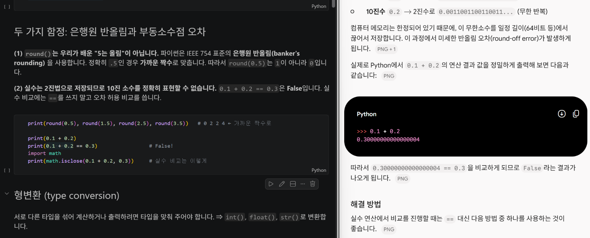
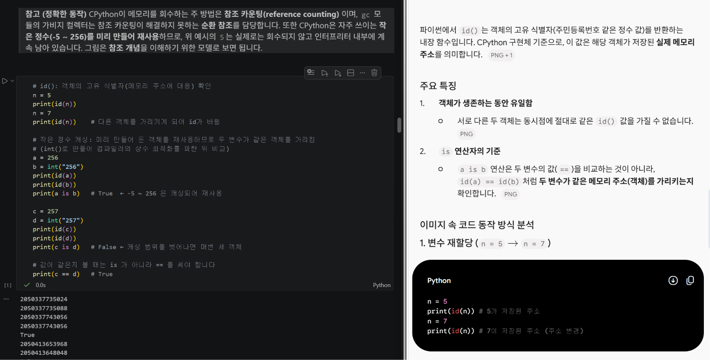

# 🐍 Python 기초 스터디 2주차 기록

기본 문법을 배우면서 생긴 궁금증을 AI에게 직접 물어보고 정리한 노트입니다.
내용이 깊지는 않고, **배운 내용을 설명하는 느낌**으로 가볍게 적었습니다.

## 📖 배운 내용

### 1. 값과 타입
- 모든 데이터는 타입을 가짐: `int`, `float`, `str`, `bool`, `tuple` 등
- `type()`으로 타입 확인
- 숫자에 콤마를 쓰면 튜플이 됨 → 밑줄(`1_000_000`) 사용하기

### 2. 숫자와 형변환
- 파이썬 정수는 크기 제한 없음
- `int()`, `float()`, `str()`로 형변환
- `int("3.5")`는 안 되고 `int(float("3.5"))`처럼 두 단계로 변환

### 3. 변수와 명명 규칙
- `=`는 "같다"가 아니라 왼쪽 이름표에 값을 연결하는 것
- 숫자로 시작 안 됨, 공백/하이픈 안 됨, 관례는 `snake_case`
- 예약어(`if`, `for` 등)는 변수명으로 불가

### 4. 문자열: 인덱싱과 슬라이싱
- `len(s)`: 길이
- `s[i]`: 인덱싱 (0부터, 음수는 뒤에서)
- `s[a:b]`: 슬라이싱 (b **직전**까지)
- `s[::-1]`: 문자열 뒤집기

```python
s = "Python"
print(s[0])     # 'P'
print(s[-1])    # 'n'
print(s[0:3])   # 'Pyt'
print(s[::-1])  # 'nohtyP'
```

## 🤖 AI에게 물어본 궁금증

배우면서 "왜 이렇게 되지?" 싶었던 부분을 AI한테 직접 질문하고 원리를 이해했습니다.

### Q1. 왜 `round(0.5)`는 0일까? 왜 `0.1 + 0.2 == 0.3`은 False일까?



- **은행원 반올림**: `.5` 정확히 절반일 때는 가까운 **짝수**로 반올림됨 (0.5→0, 1.5→2)
- **부동소수점 오차**: 컴퓨터가 소수를 2진수로 바꿀 때 정확히 표현 못 해서 오차가 생김 → `0.1 + 0.2`는 `0.30000000000000004`
- 실수 비교는 `==` 대신 `math.isclose()` 사용하기

```python
import math
print(math.isclose(0.1 + 0.2, 0.3))  # True
```

### Q2. 같은 `256`은 같은 메모리인데 `257`은 왜 다른 메모리일까?



- 파이썬 변수는 "상자"가 아니라 메모리 객체를 가리키는 **참조(이름표)**
- CPython은 프로그램 시작 시 **`-5 ~ 256` 정수를 미리 만들어 두고 재사용**함 → 주소가 같음
- `257`부터는 매번 새로 만들어져서 주소가 다름
- 값 비교는 `==`, 같은 객체인지 확인은 `is`

## 📝 한 줄 회고

문법만 외우는 게 아니라, 소수점 오차나 메모리 저장 원리 같은 걸 AI한테 질문하면서 "왜 이렇게 동작하는지"까지 이해할 수 있었던 스터디였습니다.

---

*이 문서는 GitHub Pages로 간단하게 공유한 기록입니다.*